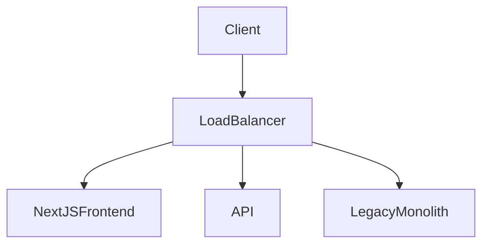

# Separate Services

Convert a single monolith into multiple services. This isn't intended to be as granular as microservices, but a middle ground.

Monolith currently contains multiple codebases all in one deployment.

Public Facing Services:

- `app.example.com` <- new NextJS frontend
- `www.example.com` <- legacy monolith
- `api.example.com` <- new API service
- CDN

Private Services:

- workers
- message bus
