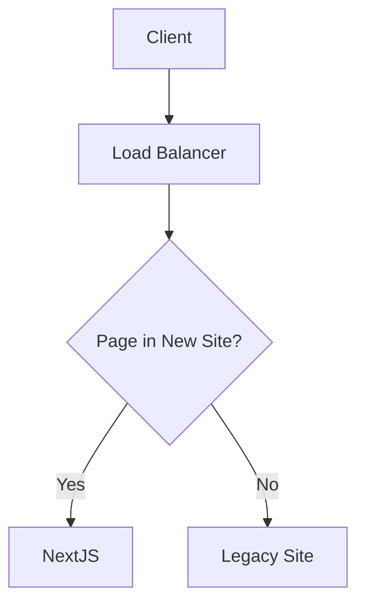

# Strangler Fig pattern



This can be tested by launching the app

```sh
docker compose up
http://localhost:8080
http://localhost:8080/hello # <- nextjs
http://localhost:8080/legacy.php # <- legacy php code
```
